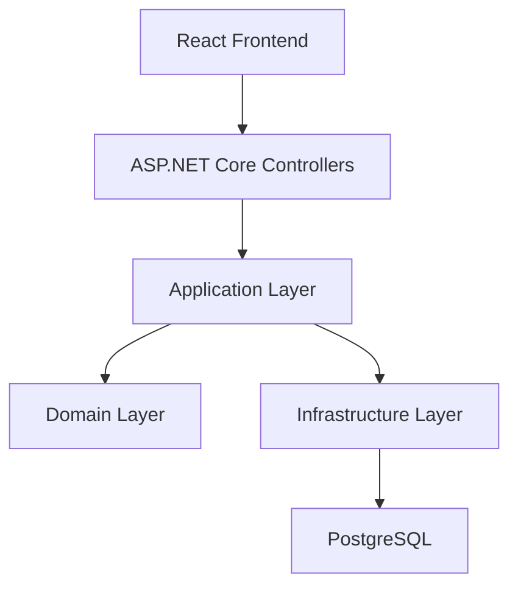

# Layered Monolith Architecture Guide

## Core Idea

The purpose of layering is to separate responsibilities, not to create ceremony.

Each layer should have a clear reason to exist:

- Presentation: HTTP endpoints, controllers, request validation, auth integration, DTO mapping
- Application: use cases, orchestration, transactions, coordination of domain behavior
- Domain: business rules, entities, value objects, invariants
- Infrastructure: database access, file storage, email, external API clients

## Reference Flow



## System Context

The application is used by internal operations staff. It is not a public-facing customer platform.

Primary actors:

- warehouse operator
- purchasing officer
- inventory planner
- operations manager

Core operational flow:

1. products are defined in the catalog
2. stock is received into a warehouse
3. stock levels are tracked centrally
4. transfers move stock between warehouses
5. adjustments correct damaged, missing, or found inventory
6. reports highlight low stock and operational exceptions

## Learning Focus

When reading this document, focus on:

- how one deployable application can still have clear internal separation
- how dependency direction protects business logic
- how transactional workflows influence architecture choices

## Layer Responsibilities

### Presentation Layer

This layer handles input and output. It should know about HTTP, cookies, JWTs, JSON payloads, and response formatting.

It should not contain business rules such as stock allocation logic, reorder rules, or transfer approval validation.

Examples:

- product search API
- warehouse stock summary API
- login and session endpoints
- input validation for create or update requests
- mapping domain results into API response models

### Application Layer

This layer contains use cases. It coordinates work across the domain model and infrastructure abstractions.

Examples:

- receive 250 units of `LAP-14-BLK` into the Brisbane warehouse
- transfer 40 office chairs from Sydney to Melbourne
- approve a damaged-stock write-off above manager threshold
- reserve inventory for an approved sales order

This layer is often the best place for transaction boundaries and workflow orchestration.

### Domain Layer

This is where the business meaning lives.

Examples:

- `Product`
- `Warehouse`
- `InventoryItem`
- `StockTransfer`
- `StockAdjustment`

The domain layer should protect business invariants such as:

- inventory cannot go below zero unless backorders are explicitly supported
- stock transfers must reference valid source and destination warehouses
- approved adjustments must include an auditable reason
- high-value adjustments must be approved by a manager role

### Infrastructure Layer

This layer handles technical details.

Examples:

- Entity Framework Core repositories
- PostgreSQL persistence
- email sender
- file storage
- background job adapters

Infrastructure should support the domain and application layers rather than drive them.

## Recommended Project Shape

```text
src/
  Web/
  Application/
  Domain/
  Infrastructure/
```

Possible role of each project:

- `Web`: ASP.NET Core host, controllers, authentication, SPA static-file hosting
- `Application`: commands, queries, DTOs, services, interfaces
- `Domain`: entities, value objects, domain services, business rules
- `Infrastructure`: EF Core, repositories, migrations, external integrations

## Internal Module Boundaries

Even inside a layered monolith, business areas should be separated.

Recommended internal modules:

- `Catalog`: products, SKUs, supplier references, reorder settings
- `Warehouses`: warehouse metadata, location status, operating rules
- `Inventory`: on-hand quantities, receipts, adjustments, audit trail
- `Transfers`: stock movement between warehouses, transfer lifecycle
- `Reporting`: dashboards, low-stock views, movement summaries
- `Identity`: users, roles, permissions, session context

This keeps the application easier to evolve into a modular monolith later if needed.

## Dependency Direction

Keep dependencies flowing inward:

- `Web` depends on `Application`
- `Application` depends on `Domain`
- `Infrastructure` depends on `Application` and `Domain`
- `Domain` depends on nothing application-specific

This keeps business logic stable even if delivery or infrastructure details change.

## Concrete Request Flows

### Receive Stock

1. React form submits a stock receipt request.
2. Controller validates request shape and user identity.
3. Application service loads product and warehouse context.
4. Domain rules verify the product is active and quantity is valid.
5. Infrastructure persists receipt and updates inventory balances in one transaction.
6. Reporting views reflect the updated stock level.

### Transfer Stock

1. Inventory planner requests a transfer from Brisbane to Sydney.
2. Application layer checks current available stock.
3. Domain layer verifies source and destination warehouses are valid and distinct.
4. Transfer record is created and source inventory is reserved immediately.
5. Dispatch later reduces source `quantityOnHand` and clears the reservation.
6. Receipt at destination increases destination `quantityOnHand`.
7. Audit trail is written with user, timestamp, and reason at each step.

### Adjust Stock

1. Warehouse operator submits an adjustment after a cycle count.
2. Domain rules determine whether approval is required.
3. Small adjustments may be auto-approved.
4. Large or high-value adjustments remain pending for an operations manager.
5. Once approved, inventory balance changes are committed.

## Authorization Model

Suggested permission boundaries:

- warehouse operator: create receipts, submit adjustments, view local stock
- inventory planner: create transfers, view stock across warehouses, review low-stock reports
- purchasing officer: manage supplier-related receipt data and product replenishment settings
- operations manager: approve high-value adjustments, view all warehouse activity, override exceptional operations

Controllers should enforce authentication, but business-sensitive authorization should still be validated in the application layer for critical actions.

Locked V1 access rules:

- warehouse operators are restricted to explicitly assigned warehouses
- inventory planners, purchasing officers, and operations managers can view all warehouses
- only operations managers can approve or reject pending adjustments
- only transfers not yet dispatched can be cancelled

## Data Consistency Strategy

Because this is a layered monolith, the default consistency model should be strong consistency inside a single relational transaction.

Recommended rules:

- update inventory and write audit records in the same transaction
- avoid eventual consistency unless a later requirement demands it
- keep a single source of truth for on-hand stock
- model approval state explicitly rather than inferring it from side effects
- persist transfer reservations and stock movements as explicit state changes

## Error Handling Strategy

Expected categories:

- validation errors: malformed requests, missing required fields
- business rule errors: insufficient stock, invalid transfer, approval required
- authorization errors: user lacks required permission
- system errors: database unavailability, unexpected exceptions

API responses should distinguish these clearly so the frontend can present actionable messages.

Important business error cases for V1:

- transfer requested for inactive warehouse
- transfer quantity exceeds available stock
- adjustment submitted for unassigned warehouse
- approval attempted by non-manager role

## Background Processing

This system does not require a distributed event architecture for MVP.

Reasonable background jobs inside the monolith:

- nightly low-stock snapshot refresh
- scheduled inventory health reports
- cleanup of expired sessions or temporary files

These jobs can run in-process or as a companion worker hosted inside the same application deployment if needed.

## Architecture Decision Rules

Before adding a new technical pattern, ask:

1. does it solve a real current problem
2. can it stay inside the monolith first
3. does it preserve transactional clarity
4. does it reduce or increase operational burden

If the answer weakens simplicity without solving an actual constraint, it should be rejected for the first implementation.

## Common Mistakes

- putting business rules directly in controllers
- letting EF Core entities become the entire domain model
- letting UI needs drive database schema without domain thinking
- adding a repository for every table without a use-case focus
- calling infrastructure code directly from the domain layer

## Practical Boundary Rules

- Controllers should be thin.
- Application services should coordinate, not become giant "god services".
- Domain objects should enforce important rules.
- Infrastructure should be replaceable without rewriting business decisions.

## When To Evolve Beyond This

Move toward a modular monolith when:

- teams begin owning separate business areas
- unrelated features keep colliding in the same code paths
- module boundaries matter more than simple layering

Move toward microservices only when:

- independent deployment becomes a real operational need
- scaling differences are persistent and meaningful
- the team can support observability, messaging, and distributed debugging
