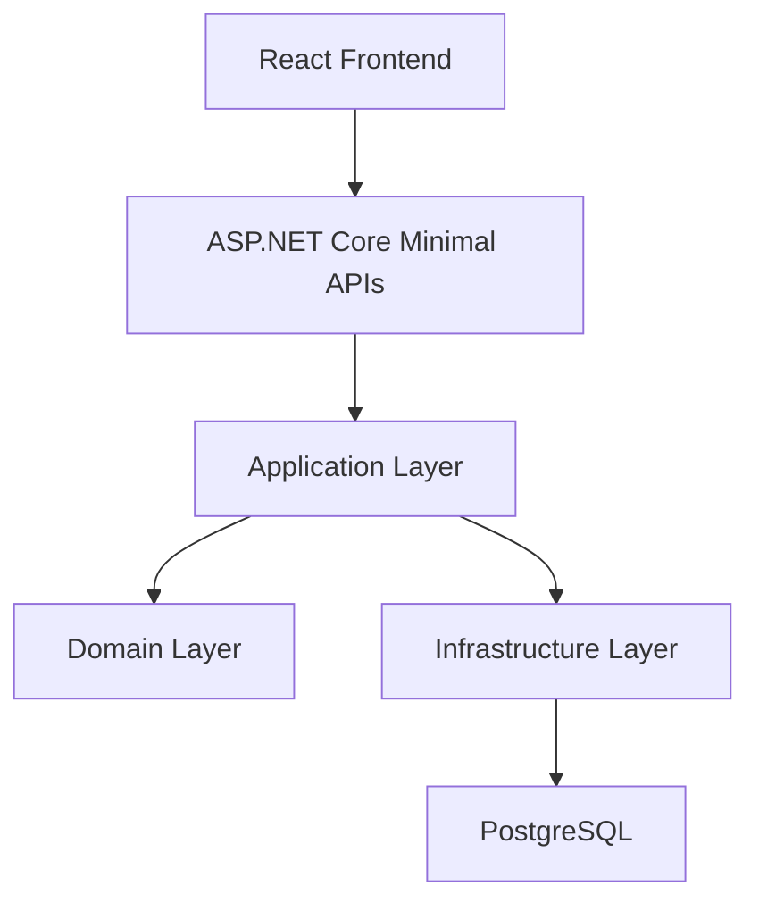

# Layered Monolith Architecture Guide

## Core Idea

The purpose of layering is to separate responsibilities, not to create ceremony.

Each layer should have a clear reason to exist:

- Presentation: HTTP endpoints, request validation, auth integration, DTO mapping, session handling
- Application: use-case orchestration and transaction boundaries
- Domain: business rules, entities, invariants, workflow state transitions
- Infrastructure: database access, identity persistence, seeding, external integrations

## Reference Flow



## System Context

The application is used by internal operations staff. It is not a public-facing customer platform.

Primary actors:

- warehouse operator
- purchasing officer
- inventory planner
- operations manager

Core operational flow:

1. products are defined in the catalog
2. stock is received into a warehouse
3. stock levels are tracked centrally
4. transfers move stock between warehouses
5. adjustments correct damaged, missing, or found inventory
6. reports highlight low stock and operational exceptions

## Current Implementation Reality

The repository structure follows the layered model, but the current tutorial implementation is intentionally simplified.

Implemented now:

- separate `Web`, `Application`, `Domain`, and `Infrastructure` projects
- domain entities holding core business rules and workflow transitions
- infrastructure handling EF Core persistence, Identity, and seeding
- presentation layer handling auth, validation, response mapping, and most current orchestration

Not yet fully realized:

- a rich application layer with explicit commands, queries, and use-case services

That means the tutorial is architecturally aligned, but not yet a fully mature layered implementation.

## Learning Focus

When reading this document, focus on:

- how one deployable application can still have clear internal separation
- how dependency direction protects business logic
- where the current implementation is clean enough for learning and where it is intentionally simplified

## Layer Responsibilities

### Presentation Layer

This layer handles input and output. It knows about HTTP, cookies, JSON payloads, and response formatting.

Current implementation examples:

- login and session endpoints
- product, warehouse, inventory, transfer, and adjustment endpoints
- request contract validation
- authorization checks and warehouse scope filtering
- response mapping to API models

### Application Layer

This layer should contain explicit use cases and orchestration.

Current implementation status:

- the `Application` project exists
- it currently provides only dependency wiring
- most orchestration still lives in the endpoint modules

This is the main architectural gap between the intended design and the current tutorial implementation.

### Domain Layer

This is where the business meaning lives.

Current implementation examples:

- `Product`
- `Warehouse`
- `InventoryItem`
- `StockTransfer`
- `InventoryAdjustment`
- `InventoryReceipt`
- `UserWarehouseAssignment`

The domain layer protects business invariants such as:

- inventory cannot reserve or dispatch more stock than is available
- source and destination warehouses in a transfer must be different
- transfer state transitions are validated explicitly
- adjustment approval thresholds are evaluated consistently
- cancelling after dispatch is not allowed

### Infrastructure Layer

This layer handles technical details.

Current implementation examples:

- Entity Framework Core `DbContext`
- PostgreSQL persistence
- ASP.NET Core Identity persistence
- startup seeding for users, roles, warehouses, products, and inventory
- warehouse assignment persistence

## Recommended Project Shape

```text
src/
  Web/
  Application/
  Domain/
  Infrastructure/
```

That shape is already present in the repository.

## Internal Module Boundaries

Recommended internal business modules:

- `Catalog`
- `Warehouses`
- `Inventory`
- `Transfers`
- `Reporting`
- `Identity`

Current implementation status:

- these concerns are visible in the endpoint and domain structure
- they are not yet separated into fully explicit application modules

## Dependency Direction

Keep dependencies flowing inward:

- `Web` depends on `Application`
- `Application` depends on `Domain`
- `Infrastructure` depends on `Application` and `Domain`
- `Domain` depends on nothing application-specific

The current project references follow this model, even though the application layer is still thin.

## Concrete Request Flows

### Receive Stock

1. React submits a stock receipt request.
2. The endpoint validates authentication, role, and warehouse access.
3. Product and warehouse state are loaded from persistence.
4. Domain rules validate the product and quantity.
5. The inventory item is updated and the receipt is stored.
6. The actor is recorded from the authenticated session.

### Transfer Stock

1. A planner or manager requests a transfer.
2. The endpoint validates stock and warehouse state.
3. The source inventory record reserves stock immediately.
4. The transfer remains `Requested` until approval.
5. Dispatch reduces source on-hand stock.
6. Receipt increases destination on-hand stock.
7. Each transition records actor and timestamp.

### Adjust Stock

1. An operator or manager submits an adjustment.
2. Warehouse access is validated.
3. Domain rules evaluate whether approval is required.
4. Small adjustments are auto-approved.
5. Large or high-value adjustments remain pending for manager review.
6. Inventory changes are applied only when the adjustment becomes `Approved`.

## Authorization Model

Current permission boundaries:

- warehouse operator: receipts, adjustments, dispatch, and receive for assigned warehouses only
- inventory planner: create and approve transfers across all warehouses
- purchasing officer: manage product data and create receipts
- operations manager: manage warehouses, approve or reject adjustments, cancel transfers, and perform cross-warehouse operations

Important implementation note:

- authorization is enforced directly in the endpoint layer today
- warehouse scope filtering is applied from persisted assignments
- workflow actor identity comes from the signed-in session, not the client payload

## Data Consistency Strategy

This tutorial uses strong consistency inside one relational database.

Current rules:

- inventory updates and workflow state changes are committed together
- transfer reservations and stock movements are explicit state changes
- approval state is persisted, not inferred
- the same database remains the source of truth for inventory balances and workflow records

## Error Handling Strategy

Expected categories:

- validation errors: malformed requests, missing required fields
- business rule errors: insufficient stock, invalid transition, archived product usage
- authorization errors: user lacks required role or warehouse access
- system errors: database unavailability or unexpected exceptions

The current API distinguishes these with `400`/validation responses, `401`, `403`, `404`, and `409` where appropriate.

## Background Processing

The current tutorial implementation does not use background workers or messaging.

That is appropriate for the current scope because the workflows are synchronous and transactional.

## Architecture Decision Rules

Before adding a new technical pattern, ask:

1. does it solve a real current problem
2. can it stay inside the monolith first
3. does it preserve transactional clarity
4. is it worth the operational cost for this tutorial

## Common Mistakes

- putting business rules directly in controllers or endpoints
- letting the current simplified endpoint orchestration become the permanent architecture
- adding abstractions that are not yet needed
- confusing tutorial-local convenience with production architecture guidance

## Practical Boundary Rules

- Endpoints should stay thin over time.
- Application services should own orchestration as complexity grows.
- Domain objects should enforce important rules.
- Infrastructure should remain a support layer, not the driver of business decisions.

## When To Evolve Beyond This

Good next evolution steps:

- move workflow orchestration into application services
- split the monolith into stronger internal modules
- only consider microservices if independent deployment and scaling become real operational needs
