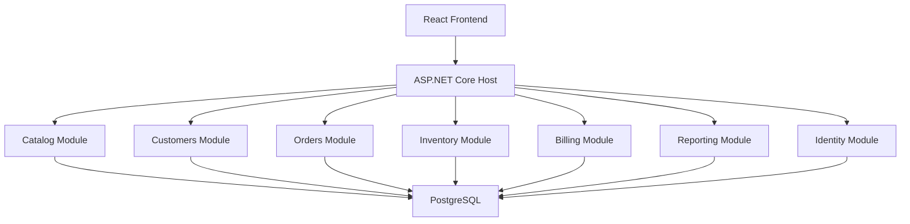

# Modular Monolith Architecture Guide

## Core Idea

The purpose of a modular monolith is to preserve one deployment unit while giving each business capability clear internal ownership.

The central architectural rule is:

- one application
- many modules
- explicit boundaries
- no accidental coupling

## Reference Flow



## System Context

The application is used by internal staff coordinating wholesale operations.

Primary actors:

- sales coordinator
- warehouse operator
- finance officer
- operations manager

Core operational flow:

1. customers are managed in the `Customers` module
2. products are managed in the `Catalog` module
3. sales creates orders in the `Orders` module
4. inventory reservations are managed by the `Inventory` module
5. invoices are issued by the `Billing` module
6. reporting reads summarize activity across modules

## Learning Focus

When reading this document, focus on:

- how business boundaries differ from technical layers
- how modules own data and behavior inside one runtime
- how internal contracts replace the need for service-to-service communication in V1

## What Makes This Different From 001

A layered monolith focuses first on technical separation by layer.

A modular monolith adds an additional constraint:

- business modules must be explicit
- each module should own its data and write rules
- cross-module workflows should go through approved contracts rather than direct coupling

This tutorial should make that difference concrete.

## Module Responsibilities

### Catalog Module

Owns:

- products
- SKUs
- product categories
- sellable product metadata

Does not own:

- customer-specific pricing logic in V1
- inventory quantities
- invoice state

### Customers Module

Owns:

- business customer records
- account status
- billing and shipping contacts
- internal customer reference data

Does not own:

- order lifecycle
- invoice lifecycle
- product metadata

### Orders Module

Owns:

- order headers
- order lines
- order lifecycle state
- order-level business validation

Does not own:

- product catalog records
- inventory balances
- invoice records

### Inventory Module

Owns:

- stock balances
- stock reservations
- warehouse stock views
- fulfillment readiness support data

Does not own:

- customer accounts
- order pricing
- invoices

### Billing Module

Owns:

- invoices
- invoice status
- internal payment-state tracking for MVP

Does not own:

- order submission
- inventory reservations
- customer master records

### Reporting Module

Owns:

- cross-module read models
- dashboards and summary views

Does not own:

- operational writes back into the source modules

### Identity Module

Owns:

- users
- roles
- authentication
- module-level access control rules

## Recommended Solution Shape

```text
src/
  Host/
  Modules/
    Catalog/
      Api/
      Application/
      Domain/
      Infrastructure/
    Customers/
      Api/
      Application/
      Domain/
      Infrastructure/
    Orders/
      Api/
      Application/
      Domain/
      Infrastructure/
    Inventory/
      Api/
      Application/
      Domain/
      Infrastructure/
    Billing/
      Api/
      Application/
      Domain/
      Infrastructure/
    Reporting/
      Api/
      Application/
      Domain/
      Infrastructure/
    Identity/
      Api/
      Application/
      Domain/
      Infrastructure/
  BuildingBlocks/
```

`BuildingBlocks/` should stay minimal. It exists only for truly shared abstractions that do not destroy module ownership.

## Dependency Direction

Recommended rules:

- the host application can reference all modules
- modules should not freely reference each other’s infrastructure or database code
- modules may depend on shared building blocks only when the shared type is genuinely stable and generic
- cross-module interaction should happen through explicit application contracts or orchestration paths

Strong boundary rule for V1:

- one module may not directly update another module’s tables

## Data Ownership Strategy

This architecture still uses one relational database, but data ownership must remain explicit.

Recommended rule:

- each module owns its tables and write logic
- each module should use a distinct schema where practical
- cross-module reporting reads may aggregate data, but operational writes must stay in the owning module

Example:

- `orders.orders` and `orders.order_lines` belong to `Orders`
- `inventory.stock_items` and `inventory.reservations` belong to `Inventory`
- `billing.invoices` belongs to `Billing`

## Cross-Module Integration Strategy

V1 should stay in-process.

Recommended options:

- direct orchestration through explicit application services exposed by a module
- internal commands or requests handled inside the same runtime
- internal domain events only if they remain in-process and understandable

Do not use in V1 unless clearly justified:

- external message brokers
- distributed event buses
- service discovery or network-based module communication

## Concrete Workflow Example

### Create Order And Reserve Inventory

1. A sales coordinator creates an order in the `Orders` module.
2. `Orders` validates customer and line-item shape.
3. `Orders` requests inventory reservation through an explicit `Inventory` contract.
4. `Inventory` evaluates stock and either reserves quantity or rejects the request.
5. `Orders` updates its lifecycle state based on the result.
6. Reporting later reads both order and inventory data for operational dashboards.

### Invoice Eligible Order

1. An order reaches `ReadyForInvoicing`.
2. `Orders` requests invoice creation through a `Billing` application contract.
3. `Billing` creates and owns the invoice.
4. `Orders` stores only the reference needed to relate the order to the billing outcome.

This is a key modular-monolith lesson: modules collaborate without owning each other’s state transitions.

## Authorization Model

Suggested role boundaries:

- sales coordinator: customers, catalog browsing, orders
- warehouse operator: inventory and fulfillment views
- finance officer: invoices and billing views
- operations manager: cross-module reporting and operational oversight

Authorization should be enforced both:

- at the HTTP/API boundary
- at the module-use-case boundary for sensitive operations

## Error Handling Strategy

Expected categories:

- validation errors: malformed requests, missing fields
- business rule errors: insufficient stock, invalid order state, invalid invoice transition
- authorization errors: user lacks module access
- system errors: database or infrastructure failures

Important V1 error cases:

- order creation with inactive customer
- reservation request with insufficient stock
- invoice issue attempted before order readiness
- direct write attempted against another module’s data ownership boundary

## Reporting Boundary Rule

`Reporting` is allowed to read across modules, but it must not become a hidden integration shortcut.

Practical rule:

- reporting can read module-owned data for dashboards and summaries
- reporting cannot become the place where operational workflows are coordinated

## Background Processing

The modular monolith does not require distributed messaging in V1.

Reasonable internal background jobs later:

- nightly summary generation
- stale order review jobs
- invoice aging refresh jobs

If added, they should still operate inside the same deployment unit first.

## Architecture Decision Rules

Before adding a new shared abstraction or cross-module integration path, ask:

1. who owns this behavior
2. which module owns the data
3. can this stay in-process
4. does this make ownership clearer or blurrier

If the answer weakens ownership clarity, reject the change.

## Common Mistakes

- sharing entities across modules too freely
- letting one module query and mutate another module’s tables directly
- creating a giant shared project that becomes a second monolith inside the monolith
- adding messaging before module boundaries are stable in-process
- confusing one database with no ownership boundaries

## Practical Boundary Rules

- Modules should expose small, explicit contracts.
- Shared code should stay minimal.
- Reporting reads must not become write backdoors.
- The host should compose modules, not absorb their business logic.

## When To Evolve Beyond This

Move beyond a modular monolith only when:

- some modules need clearly different deployment cadences
- one or two modules require very different scaling characteristics consistently
- teams can support observability, deployment, and debugging across service boundaries

If those conditions are not present, keep the system modular and in one deployable application.
