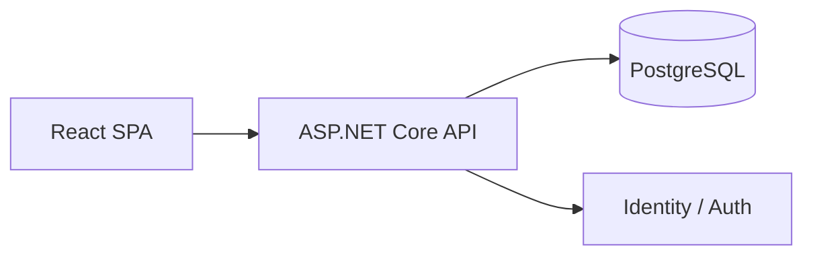

# Client-Server SPA + API Architecture Guide

## Core Idea

The purpose of this architecture is to split the system into two clear runtime concerns:

- the client renders and drives interactive user workflows
- the server owns business rules, persistence, authentication, authorization, and API contracts

The frontend should feel fast and app-like. The backend should remain the source of truth.

## Reference Flow



## System Context

The application is used by internal project teams.

Primary actors:

- workspace admin
- project manager
- contributor
- viewer

Core operational flow:

1. a user signs in through the web client
2. the SPA loads dashboard and project data through API calls
3. the user updates projects, tasks, and comments through API endpoints
4. the server validates the request and persists the result
5. the SPA refreshes or reconciles local state based on the API response

## Learning Focus

When reading this document, focus on:

- what belongs in the client and what belongs in the server
- how route-driven UI and API contracts support one another
- why the backend must remain the authority for workflow state and authorization

## What Makes This Different From 001 And 002

`001` and `002` focus more on backend internal structure.

`003` focuses on the boundary between the browser client and the backend application.

Key lesson:

- this architecture is defined less by backend modularity and more by the contract between UI and server

## Client Responsibilities

The SPA should own:

- route-based navigation
- rendering and view composition
- form interaction state
- query and mutation orchestration
- loading, empty, and error presentation
- local UI state such as selected filters, open panels, and optimistic UX where appropriate

The SPA should not own:

- authoritative business rules
- permission decisions
- workflow state transitions as a source of truth
- persistence logic

## Server Responsibilities

The backend API should own:

- authentication and authorization
- request validation for business workflows
- project, task, and comment lifecycle rules
- persistence and transaction control
- API contract stability
- auditing and important timestamps where needed

## Same-Origin Hosting Strategy

The preferred V1 direction is same-origin hosting.

That means:

- the built SPA is served from the same application host as the API in production
- cookie authentication is simpler and safer for the first implementation
- CORS complexity is minimized for the initial release

During development, a separate Vite dev server is acceptable.

## Authentication Model

Recommended V1 model:

- same-origin cookie auth
- ASP.NET Core Identity or an equivalent web auth mechanism
- React client restores session state by calling `/api/auth/me`

Why this fits:

- the system is internal and web-first
- same-origin deployment is planned
- the architecture should stay simple before adding token-based complexity

## Route Strategy

Suggested client routes:

```text
/login
/dashboard
/projects
/projects/:projectId
/tasks/:taskId
/settings
```

Suggested API route families:

```text
/api/auth/*
/api/projects/*
/api/tasks/*
/api/projects/{projectId}/members
/api/tasks/{taskId}/comments
/api/dashboard/*
/api/users/*
```

Route design rule:

- client routes are about screens and navigation
- API routes are about server resources and workflows

## State And Data Flow Rules

Recommended rules:

- load data by screen or workflow needs, not by backend table shape
- keep the API responses shaped for the UI use cases
- avoid forcing the client to stitch together too many small requests for a common page
- use pagination, filtering, and projection where list size could grow materially

## API Design Rules

The API should be shaped for business use cases, not only CRUD purity.

Good examples:

- `POST /api/tasks/{id}/start`
- `POST /api/tasks/{id}/block`
- `POST /api/tasks/{id}/complete`
- `POST /api/projects/{id}/members`
- `GET /api/dashboard/summary`

These are more useful than forcing every workflow through a generic update payload.

## Error Handling Strategy

Expected error categories:

- validation errors: malformed inputs, missing fields
- business rule errors: invalid task transition, archived project write attempt
- authorization errors: user lacks permission
- system errors: infrastructure or persistence failure

Important rule:

- the server should return clear HTTP status codes and machine-usable payloads
- the SPA should translate those into user-facing messages without inventing new business rules

## UI Responsiveness And Data Freshness

The SPA should feel responsive, but not by making the client authoritative.

Recommended approach:

- show loading and partial UI states clearly
- allow optimistic UI only where rollback is straightforward and safe
- re-fetch or reconcile server state after mutations that affect summaries or workflow state

## Filtering And Dashboard Strategy

Dashboard and list views should be API-backed, not computed entirely in the browser from huge payloads.

Recommended server-supported filters:

- project status
- task status
- assignee
- member
- due-date window
- overdue-only flag

This keeps the system scalable enough for real usage without overengineering the architecture.

## Suggested Backend Shape

Recommended backend structure:

```text
src/
  backend/
    Web/
      Controllers-or-Endpoints/
      Contracts/
      Auth/
    Application/
      Services/
      UseCases/
      Validation/
    Domain/
      Entities/
      Enums/
      Rules/
    Infrastructure/
      Persistence/
      Identity/
      Seeding/
```

The core lesson in `003` is not deep module decomposition. It is disciplined client-server separation with a clean API boundary.

Suggested backend responsibility slices:

- auth and session
- projects and project membership
- tasks and task workflow
- comments and activity feed
- dashboard and filtered queries

## Suggested Frontend Shape

Recommended React structure:

```text
src/
  app/
  routes/
  features/
    auth/
    dashboard/
    projects/
    tasks/
    comments/
  shared/
```

Each feature should consume API clients and contracts rather than reaching directly into infrastructure concerns.

Suggested route ownership:

- `dashboard/` owns summary and filters
- `projects/` owns project list, detail, and membership screens
- `tasks/` owns task detail, status actions, and comment thread
- `auth/` owns login, logout, and current-session bootstrapping

## Concrete Workflow Example

### Update Task Status

1. The user opens a task detail page in the SPA.
2. The SPA loads task data from `/api/tasks/{id}`.
3. The user clicks `Start task`.
4. The SPA calls `POST /api/tasks/{id}/start`.
5. The server validates role and current task state.
6. The server persists the transition.
7. The server returns the updated task state.
8. The SPA refreshes the task card and any affected dashboard summaries.

This is the core client-server lesson: the browser triggers workflows, but the server approves and records them.

## Concrete Workflow Example

### Add Task Comment

1. The user opens the task detail page.
2. The SPA shows task metadata and current comments.
3. The user submits a new comment.
4. The SPA calls `POST /api/tasks/{id}/comments`.
5. The server stores the comment and attaches actor and timestamp metadata.
6. The API returns the new comment payload or refreshed task-comment projection.
7. The SPA updates the comment thread.

## Project Membership Boundary

Project membership is the first important authorization boundary in this tutorial.

Rules:

- only project members and workspace admins can open project detail
- only project managers for that project and workspace admins can change membership
- assignee lists must be derived from current project members
- removing a member from a project does not delete their historical comments or task audit history

## Authorization Model

Suggested role boundaries:

- workspace admin: user access, settings, broad project control
- project manager: project and task planning, assignment, workflow oversight within owned projects
- contributor: task updates and comments within assigned work and visible projects
- viewer: read-only access within projects where they are a member

Authorization should be enforced:

- at the API boundary
- in server-side workflow handlers for sensitive operations

The client may hide controls for better UX, but the API remains the authority.

## Common Mistakes

- putting real business validation only in the SPA
- making the API too generic and forcing the client to reconstruct workflows
- making the API too chatty for common screens
- duplicating permission logic in the client and server inconsistently
- leaking database shape directly into the frontend route design

## Architecture Decision Rules

Before adding a new UI flow or API route, ask:

1. is the server still the authority for this workflow
2. is the response shaped for the screen or forcing unnecessary client stitching
3. is the auth model still simple and same-origin friendly
4. does the route represent a real business action or only a table mutation

If the answer makes the system more coupled or more chatty, redesign the contract.

## When To Evolve Beyond This

Move beyond a simple SPA + API shape only when:

- the backend truly needs separate scaling or service boundaries
- additional clients become important enough to reshape auth and contract needs materially
- real-time collaboration or asynchronous integration becomes a first-class requirement

If those conditions are not present yet, keep the architecture simple and disciplined.
