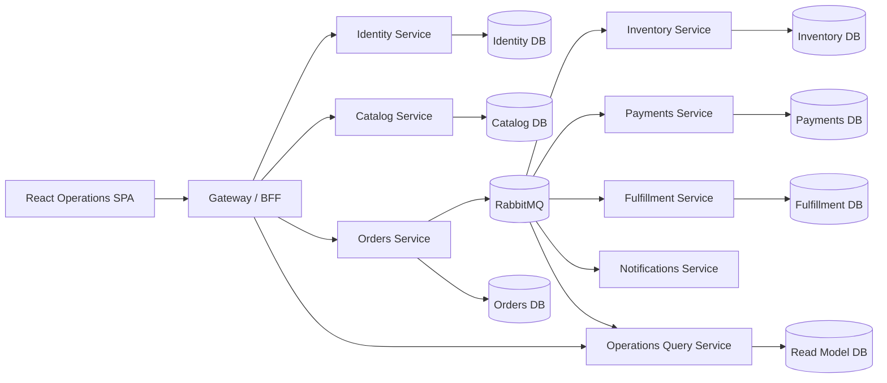

# Microservices Architecture Guide

## Core Idea

The purpose of this architecture is to divide the system into independently deployable services that each own a focused business capability, its operational data, and its runtime lifecycle.

The browser should see one coherent product. The platform team should see many explicit service boundaries.

## Reference Flow

## System Context

The application is used by internal commerce operations teams.

Primary actors:

- catalog manager
- order operations agent
- inventory coordinator
- finance reviewer
- fulfillment operator
- operations manager

Core operational flow:

1. a user signs in to the React operations console
2. the browser calls the gateway or BFF
3. the gateway delegates user-facing requests to the appropriate services
4. services collaborate through HTTP and events
5. downstream services publish state changes
6. the query service updates dashboard projections

## Learning Focus

When reading this document, focus on:

- where service boundaries come from
- why data ownership matters more than directory structure
- how synchronous and asynchronous communication should be mixed deliberately
- why the gateway, broker, and observability are architectural requirements, not support details

## Service Responsibilities

### GatewayBff

Owns:

- browser-facing routing
- session-aware user access
- request shaping for the SPA
- cross-service composition only where the browser needs one coherent response

Must not own:

- core order, payment, inventory, or fulfillment business logic
- service-owned persistence
- long-running orchestration logic

### Identity

Owns:

- user records
- roles and authentication
- user context used by the gateway and services

### Catalog

Owns:

- products
- product status
- product pricing and operational metadata required by order entry

### Orders

Owns:

- order aggregate
- order lines
- order lifecycle
- the V1 orchestration of order submission and compensation

### Inventory

Owns:

- stock availability
- reservation records
- reservation release

### Payments

Owns:

- payment authorization state
- capture or void progression

### Fulfillment

Owns:

- shipment records
- picking, packing, shipping, and delivery progression

### Notifications

Owns:

- notification request handling
- delivery attempt records if persisted in V1

### OperationsQuery

Owns:

- dashboard projections
- order tracking summaries
- cross-service operational read models

Must remain read-only.

## Browser Access Strategy

The browser should not call every service directly.

The preferred V1 direction is:

- one React SPA
- one gateway or BFF as the only public browser entry point
- the gateway forwards or composes responses for the SPA

This keeps:

- auth simpler
- service discovery out of the browser
- service churn hidden from the frontend
- client contracts more stable

## Communication Rules

### Synchronous HTTP

Use synchronous HTTP when:

- the SPA needs an immediate response
- one service needs a direct validation or lookup for a user-facing action
- the workflow is not long-running

Good examples:

- gateway -> orders to create a draft order
- gateway -> catalog to retrieve product data
- gateway -> operations query to render a dashboard

### Asynchronous Messaging

Use asynchronous messaging when:

- the workflow spans multiple services
- eventual consistency is acceptable
- retries and compensation matter
- downstream side effects should not block the user request unnecessarily

Good examples:

- order submitted
- inventory reservation requested
- payment authorization requested
- order ready for fulfillment
- shipment created or delivered
- notification requested

## Data Ownership Rules

The most important rule in this architecture is:

- one service owns one set of operational data

That means:

- `Orders` never writes inventory reservations directly
- `Inventory` never updates order status directly
- `Payments` never edits order records directly
- `OperationsQuery` never owns operational writes

Cross-service state changes happen through:

- service APIs
- commands or events
- explicit orchestration logic

## Saga And Compensation Strategy

The `Orders` service orchestrates the V1 order-submission saga.

High-level flow:

1. user submits order through gateway
2. `Orders` validates the order and sets it to `Submitted`
3. `Orders` emits `OrderSubmitted`
4. `Inventory` attempts reservation and emits success or failure
5. `Payments` attempts authorization and emits success or failure
6. `Orders` waits for both dependency outcomes
7. if both succeed, `Orders` emits `OrderReadyForFulfillment`
8. if either fails, `Orders` marks the order `Failed` and emits compensation requests such as reservation release or payment void

This is the central learning point:

- distributed workflows require explicit orchestration and compensation

## Outbox And Idempotency

Microservices should not rely on best effort event publishing.

Recommended V1 reliability patterns:

- outbox pattern per service for published integration events
- idempotent event handlers
- correlation IDs carried across HTTP and broker messages
- retry rules that do not duplicate business side effects

These are not optional if the tutorial is meant to teach defensible microservice design.

## Authentication And Authorization Model

Recommended V1 model:

- browser signs in through the gateway flow
- the gateway manages browser session concerns
- services receive trusted user context or validated internal tokens
- services still enforce authorization for their own operations

Why this fits:

- the product is internal and browser-first
- the browser should not manage service topology directly
- authorization must remain service-owned even when the gateway simplifies client access

## Query And Projection Strategy

The SPA should not assemble operational dashboards by calling many services and joining data in the browser.

Recommended approach:

- `OperationsQuery` owns read models for the main operational dashboards
- services emit events that update projections
- the gateway exposes query-friendly endpoints for dashboard and order tracking views

This is a standard microservices tradeoff:

- operational writes stay distributed
- reads are shaped explicitly for UI needs

## Error Handling Strategy

Expected error categories:

- validation errors
- business rule errors
- authorization errors
- service unavailability
- delayed eventual consistency
- broker delivery or processing errors

Important rules:

- the gateway should return clear responses to the SPA
- services should return consistent machine-usable error payloads
- the UI must represent pending and failed distributed states explicitly
- tracing must make it possible to follow one workflow across services

## Observability Baseline

This architecture is not responsible without observability.

Required V1 baseline:

- structured logs per service
- correlation IDs across HTTP and events
- trace spans across the gateway and services
- health endpoints for gateway, services, broker connectivity, and query service readiness
- broker and dead-letter visibility

## Common Mistakes

- splitting services before ownership boundaries are real
- exposing many services directly to the browser
- sharing databases and calling the result microservices
- using synchronous chains for every cross-service workflow
- hiding critical orchestration logic inside the gateway
- treating observability as a future concern

## Architecture Decision Rules

Before adding a new service, route, or event, ask:

1. does this belong to a distinct business capability with clear ownership
2. does this service own its own data
3. should this interaction be synchronous or asynchronous
4. is the gateway simplifying browser access without becoming a business-logic monolith
5. can this flow be traced, retried, and tested safely

If those answers are weak, the boundary is probably wrong.

## When To Avoid Or Delay This

Delay microservices if:

- team boundaries are still unclear
- independent deployment is not actually needed
- one modular monolith would still meet the operational and business needs
- the organization cannot support broker, tracing, deployment, and incident response maturity yet
